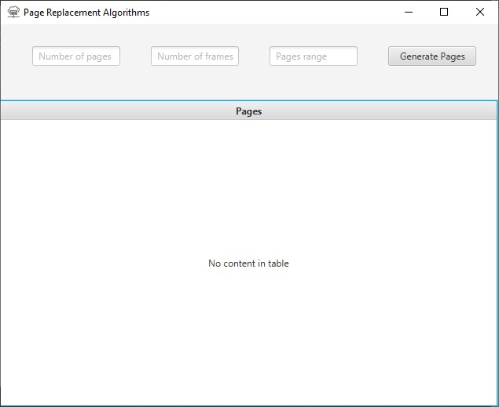
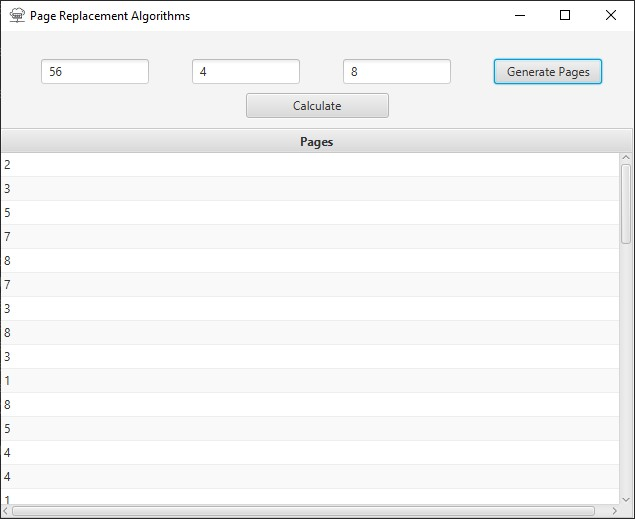
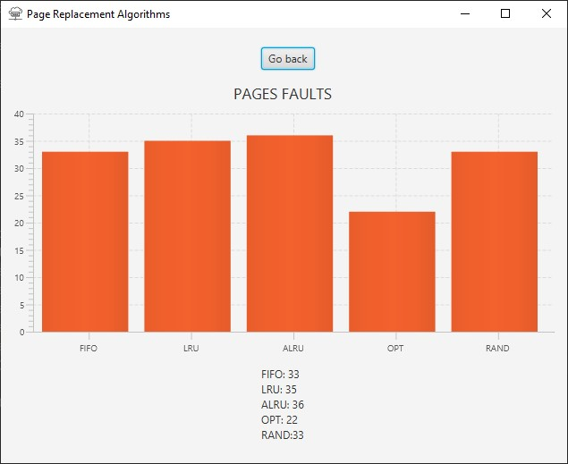

Introduction
============

Paging is a process of reading data from, and writing data to, the
secondary storage. It is a memory management scheme that is used to
retrieve processes from the secondary memory in the form of pages and
store them in the primary memory. In operating systems that use paging
for memory management, page replacement algorithm are needed to decide
which page needed to be replaced when new page comes in. Whenever a new
page is referred and not present in memory, page fault occurs and
Operating System replaces one of the existing pages with newly needed
page. Different page replacement algorithms suggest different ways to
decide which page to replace. The target for all algorithms is to reduce
number of page faults.

Important Page Replacement Terminologies
----------------------------------------

**Page Fault:** A page fault happens when a running program accesses a
memory page that is mapped into the virtual address space, but not
loaded in physical memory. Since actual physical memory is much smaller
than virtual memory, page faults happen. In case of page fault,
Operating System might have to replace one of the existing pages with
the newly needed page. Different page replacement algorithms suggest
different ways to decide which page to replace. The target for all
algorithms is to reduce the number of page faults.

Page Replacement Algorithms
---------------------------

**1. First In First Out (FIFO)**\
This is the simplest page replacement algorithm. In this algorithm, the
operating system keeps track of all pages in the memory in a queue, the
oldest page is in the front of the queue. When a page needs to be
replaced page in the front of the queue is selected for removal. What is
interesting is that there exist such a thing called Bleday’s anomaly.
This anomaly proves that it is possible to have more page faults then
increasing the number of page frames while using FIFO algorithm.\
**2. Least Recently Used(LRU)**\
This algorithm keeps track of page usage over a short period of time. It
works on the idea that the pages that have been most heavily used in the
past are most likely to be used heavily in the future too. In LRU,
whenever page replacement happens, the page which has not been used for
the longest amount of time is replaced.\
**3. Optimal Page Replacement (OPT)**\
In this algorithm, pages are replaced which would not be used for the
longest duration of time in the future, i.e., the pages in the memory
which are going to be referred farthest in the future are replaced. This
algorithm was introduced long back and is difficult to implement because
it requires future knowledge of the program behaviour.\
**4. Approximated Least Recently Used (ALRU)**\
This algorithm works by looking at the front of the queue as FIFO does,
but instead of immediately paging out that page, it checks to see if its
referenced bit is set. If it is not set, the page is swapped out.
Otherwise, the referenced bit is cleared, the page is inserted at the
back of the queue (as if it were a new page) and this process is
repeated.\
**4. Random Page Replacement Algorithm (RAND)**\
In this algorithm, the operating system will keep track of all the pages
in memory which are marked as the next replaced slot. And the selection
of which slots to replace is done randomly.

User interface
==============

Home page
---------

Generating data
---------------

Calculating and displaying results
----------------------------------

Features
========

Simulation of the following algorithms
--------------------------------------

* First in, first out (FIFO)
* Least Recently Used(LRU)
* Optimal(OPT))
* Approximated Least Recently Used (ALRU)
* Random (RAND)

Adjustable input parameters 
---------------------------

* number of pages
* number of frames
* pages reference range

Dashboard style visualisation 
-----------------------------

* GANTT chart
* number of page faults

Usage
=====

* Enter custom data:
    * Number of pages
    * Number of frames
    * Range of pages references (from 0 to given number)
* After clicking “generate pages”, “calculate” button will appear
* Click calculate and draw button to display the result

Requirements to run this project
================================

* Java FX Installed
* Java 8+

Conclusion
==========

After performing all calculations one can notice that the best algorithm
which offers a solution to the issue of providing the least page faults
is optimal algorithm. Nevertheless, it cannot be denied that is is
hardly feasible to implement this algorithm. In general FIFO and RAND
have the worst performance. They have more page faults when the number
of pages is increased. Many tests show, that FIFO and RAND, sometimes,
makes a wrong decision. They delete a page from memory and bring it back
only after two steps. This takes many times, because it writs a page in
disk and brings it back in main memory in to steps. LRU and ALRU are the
best algorithms to implement. What is interesting is that ALRU page
replacement algorithm is used in Windows and LRU page replacement
algorithm is implemented in Linux.
